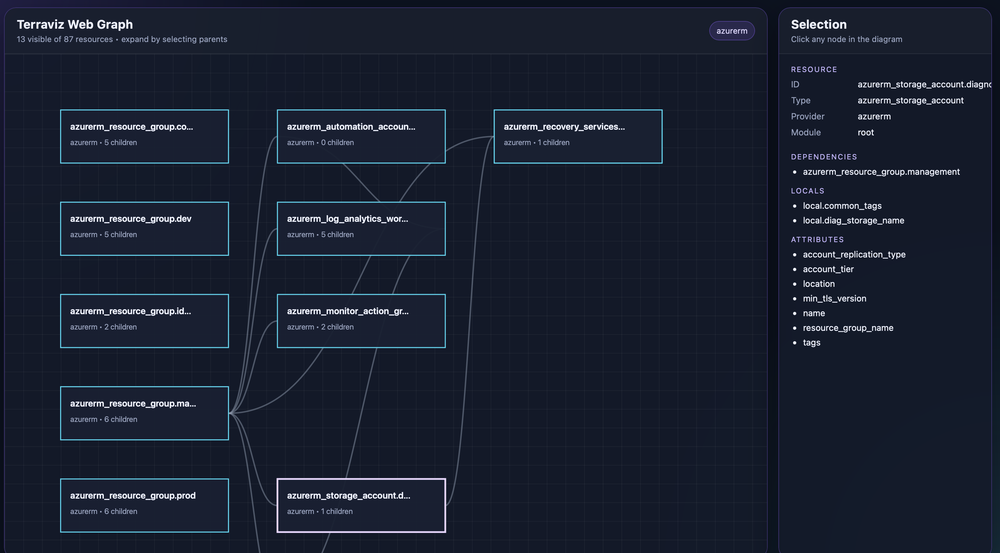

# Terraviz

An interactive terminal UI that visualizes Terraform infrastructure dependencies using **Miller Columns** (like macOS Finder). Browse your infrastructure by following dependency relationships from root resources through their dependents.

## Features

### 📂 **Miller Columns Navigation**

Browse dependencies like browsing folders in Finder:

```
┌─ Root Resources ─────┐  ┌─ Dependents ──────────┐  ┌─ Dependencies ────────┐
│ aws_vpc.main     (2) │  │ aws_subnet.public    │  │ aws_instance.web     │
│ google_compute... (0)│  │ aws_security_grou... │  │                       │
│                       │  │                       │  │                       │
└───────────────────────┘  └───────────────────────┘  └───────────────────────┘
```

- **Column 1**: Resources with no dependencies (roots like VPCs, networks)
- **Column 2**: Resources that depend on the selected root
- **Column 3**: Resources that depend on those, and so on...
- Numbers show child count: `(2)` means 2 resources depend on this

### 🏷️ **Provider Tabs**

Separate cloud providers into clean tabs:

```
  AWS    │  GOOGLE  │  AZURE
────────────────────────────────
```

- Most solutions use only 1 provider anyway
- No more mixing AWS, Google, and Azure resources
- Press `n`/`p` or `1-9` to switch tabs

### 🎯 **Multiple Input Modes**

- **Primary**: Parse `.tf` files (HCL parsing) - see what you're planning
- **Enhanced**: Automatically uses `terraform graph` for better dependency info
- **State Files**: Parse `.tfstate` files - see what's deployed

### 📊 **Detail Panel**

Right panel shows full resource details:

- Resource type, name, provider, module
- All attributes as key-value pairs
- Full list of dependencies

### 🌐 **Web Graph View**

Open the current provider-filtered graph in your browser:

- Press `w` from the TUI to launch a local web view
- Terraviz starts a small local HTTP server on `127.0.0.1` using an ephemeral port
- The browser graph shows only root resources at first, then expands children as you select parents
- The side panel shows resource metadata including variables, locals, module inputs, and attributes

## Installation

```bash
go build -o terraviz
```

## Usage

### Basic Usage

```bash
# Visualize Terraform files (PRIMARY USE CASE)
# See dependencies before deploying!
./terraviz ./terraform

# Visualize deployed infrastructure from state
./terraviz terraform.tfstate

# Pull and visualize remote state
./terraviz --from-remote ./terraform
```

### Filtering

```bash
# Show only AWS resources
./terraviz --filter aws_ ./terraform

# Show resources from a specific module
./terraviz --module vpc ./terraform
```

## Keyboard Shortcuts

| Key                | Action                                               |
| ------------------ | ---------------------------------------------------- |
| `↑`/`↓` or `k`/`j` | Navigate up/down in current column                   |
| `←` or `h`         | Move to previous column (go back up dependency tree) |
| `→` or `l`         | Move to next column (expand children/dependents)     |
| `Tab`              | Switch focus to detail panel                         |
| `n` or `]`         | Next provider tab                                    |
| `p` or `[`         | Previous provider tab                                |
| `1-9`              | Jump to specific provider tab                        |
| `w`                | Open browser graph for the current filtered view     |
| `Q` or `Ctrl+C`    | Quit                                                 |

## How It Works

### Dependency Flow

Terraviz shows **who depends on whom**:

1. **Start with roots**: Resources with no dependencies (VPCs, networks, resource groups)
2. **Select a resource**: See all resources that depend on it in the next column
3. **Keep browsing**: Navigate right to see dependents of dependents
4. **Go back**: Navigate left to move back up the tree

### Example Flow

```
Resource Group (selected)
  ↓ supports
Virtual Network, Log Analytics
  ↓ supports
Subnets, Firewall, Private Endpoints
```

In Terraviz:

1. Start with a top-level resource such as a resource group or shared network object
2. Press `→` to reveal the resources that depend on it
3. Select a child resource and press `→` again to keep following the dependency chain
4. Press `←` to move back up the tree

## Project Structure

```
terraviz/
├── main.go           # CLI interface
├── go.mod
├── parser/
│   ├── hcl.go        # HCL parser (primary - parse .tf files)
│   ├── dot.go        # DOT parser (enhanced - terraform graph)
│   └── graph.go      # Parsing coordinator
├── ui/
│   ├── app.go        # Main TUI application
│   ├── columns.go    # Miller Columns view
│   ├── detail.go     # Resource detail view
│   └── styles.go     # UI styling with provider colors
└── model/
    └── resource.go   # Core data structures
```

## Parsing Modes

### Primary: HCL Parsing

Parse `.tf` files directly to see planned infrastructure:

- See what you're about to deploy
- Works without Terraform installed
- Reads resource blocks and `depends_on` declarations

### Enhanced: Terraform Graph

If `terraform` is available, automatically enhances with:

- More accurate dependency edges
- Computed dependencies
- Better module resolution
- Status bar shows "terraform graph (enhanced)"

### State Files

Parse `.tfstate` JSON to see deployed resources:

- Local state files
- Remote state via `--from-remote`
- Shows actual deployed configuration

## Example

```bash
./terraviz ./example
```

You'll see:

- Provider tabs at top for the available cloud providers in the configuration
- First column shows top-level Azure landing zone resources
- Navigate with arrow keys to explore dependency chains
- Detail panel shows full resource info
- Press `w` to open the current view in the browser

The example folder includes a browser graph screenshot:



The browser view starts with top-level resources only, then reveals deeper layers as you select parents so large graphs stay readable.

## Web Graph

The web graph is launched from inside the TUI with `w`.

- Terraviz serves a local page and graph JSON from a loopback-only address
- The server is started on demand and reused for later launches
- The graph uses the same provider-filtered resource set you are currently viewing in the terminal UI
- Child resources are only shown when their parent path is selected, which keeps larger Terraform graphs legible

If your browser does not open automatically, Terraviz will still print the local URL in the status bar and you can open it manually.

## Requirements

- Go 1.21 or later
- Terraform (optional, for enhanced mode)

## Libraries

- [github.com/charmbracelet/bubbletea](https://github.com/charmbracelet/bubbletea) - TUI framework
- [github.com/charmbracelet/lipgloss](https://github.com/charmbracelet/lipgloss) - Styling
- [github.com/charmbracelet/bubbles](https://github.com/charmbracelet/bubbles) - UI components
- [github.com/hashicorp/hcl/v2](https://github.com/hashicorp/hcl) - HCL parsing
- [github.com/zclconf/go-cty](https://github.com/zclconf/go-cty) - HCL values

## License

MIT
